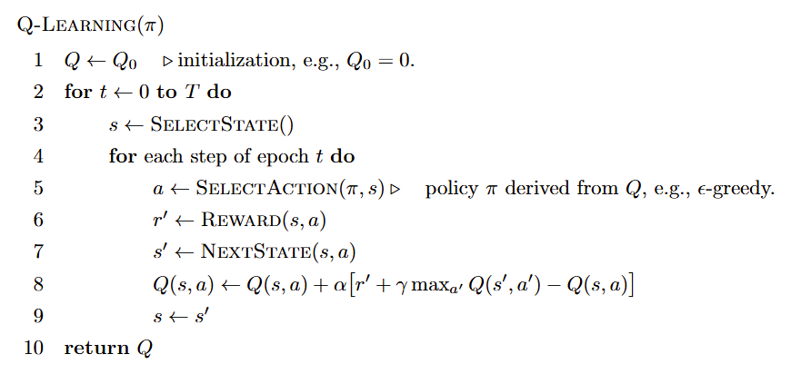

# 从头理解Q-Learning：从走迷宫到数学推理

## 1. 介绍

在强化学习的诸多算法中，Q-Learning以其简洁与力量，占据着标志性地位。它致力于解决一个根本性问题：当一个智能体（agent）处于一个状态转移模型未知的环境中时，应如何学习到一个最优的行动策略 $\pi^*$？Q-Learning巧妙地绕开了对环境模型的直接学习(model-free)，转而专注于估算一个更为关键的量：**最优状态-动作价值函数 (optimal state-action value function)**，记作 $Q^*(s, a)$。

$Q^*(s, a)$ 定义为，在状态 $s$ 下采取动作 $a$ 后，并遵循此后最优的策略所能获得的期望累积折扣回报。一旦我们得到了精确的 $Q^*$，最优策略便不言自明：在任何状态 $s$ 下，只需选择那个能使 $Q^*(s, a)$ 值最大的动作 $a$ 即可。
$$ \pi^*(s) = \arg\max_{a \in \mathcal{A}} Q^*(s, a) $$

$Q^*$ 的理论基础源于贝尔曼最优方程 (Bellman optimality equation)，它以一种递归的形式定义了该函数：

$$ Q^*(s, a) = E\left[r(s, a) + \gamma \max_{a' \in \mathcal{A}} Q^*(s', a')\right] $$

此方程的含义是：$Q^*(s, a)$等于其即时回报 $r(s,a)$ ，加上经过折扣因子 $\gamma$ 折扣后的、从后继状态 $s'$ 出发所能达到的最大未来价值的期望。这里的挑战在于，由于环境模型未知，我们无法直接利用这个方程进行计算。Q-Learning的精髓，便是提出了一种通过与环境的实际交互、不断采样来迭代逼近 $Q^*$ 的算法。

## 2. 算法

Q-Learning算法的核心是一种**时序差分 (Temporal Difference, TD)** 更新方法。它并不需要等待一个完整的交互序列结束，而是在每执行一步之后，就利用观测到的即时回报和对未来价值的当前估计，来更新当前的$Q(s, a)$。该算法可以被视为值迭代算法的一种随机近似形式。

算法维护一个 $Q(s, a)$ 表格，作为对 $Q^*(s, a)$ 的估计，并通常将其初始化为零。在学习的每个时刻，智能体处于状态 $s$，并依据一个由当前 $Q$ 表衍生的策略 $\pi$ 来选择一个动作 $a$。这个策略 $\pi$ 必须保证充分的探索，以确保所有状态-动作对都能被近似无限次访问，$\epsilon$-greedy策略便是一个常见的选择。

在执行动作 $a$ 后，智能体观测到即时回报 $r'$ 和新的状态 $s'$。紧接着，算法执行其更新步骤：

$$ Q(s, a) \leftarrow Q(s, a) + \alpha\left[r' + \gamma \max_{a' \in \mathcal{A}} Q(s', a') - Q(s, a)\right] $$

让我们剖析这个更新规则：
*   $Q(s, a)$ 是我们对该状态-动作对价值的**旧估计**。
*   $r' + \gamma \max_{a' \in \mathcal{A}} Q(s', a')$ 是基于本次交互所得到的**新目标值**。
*   $\alpha$ 是**学习率 (learning rate)**，它控制了我们用新目标值更新旧估计的步长。

这个过程不断重复，通过一次次的采样与更新，将贝尔曼最优方程的期望操作，转化为一个基于实际观测的、不断修正的估计过程。


**收敛性**
在有限马尔可夫决策过程 (finite MDP) 的假设下，Q-Learning的收敛性是有理论保证的，只要学习率 $\alpha_t(s,a)$ 满足以下条件：
$$ \sum_{t=0}^{\infty} \alpha_t(s,a) = +\infty \quad \text{and} \quad \sum_{t=0}^{\infty} \alpha_t^2(s,a) < +\infty $$
$Q_t(s,a)$ 将以概率1收敛到最优值 $Q^*(s,a)$。第一个条件保证了每个状态-动作对被无限次访问；第二个条件则保证了步长最终会变得足够小，使得算法得以收敛。

下面是该算法的伪代码描述：



需要注意的是，Q-Learning是**off-policy**的。因为它更新的策略（或者说$Q(s, a)$）和它实际执行的策略 $\pi$ 是不同的。

## 3. 走迷宫的实现
我们提供了一个简单的走迷宫的Q-Learning实现，代码：https://github.com/schinger/Q-Learning。

一个迷宫表示的例子为：
```
maze = [
    ['S', '.', '#', '#', '#'],
    ['.', '.', '.', '#', 'E'],
    ['#', '#', '.', '#', '.'],
    ['#', '.', '.', '.', '.'],
    ['#', '#', '#', '#', '#']
]
```
其中，`S`表示起点，`E`表示终点，`.`表示可通行的路径，`#`表示墙壁。
state表示为迷宫中的坐标，例如(0, 0)表示迷宫的左上角。
action表示为上下左右四个方向的移动。到达终点时reward为10，撞墙或者越界时reward为-1，其他情况reward为-0.1（鼓励尽快到终点）。训练策略采用$\epsilon$-greedy。$Q(s, a)$更新代码为：
```python
q_table[state][action_index] += learning_rate * (reward + discount_factor * np.max(q_table[next_state]) - q_table[state][action_index])
```
几秒钟训练完毕之后我们即可用learned Q-table来走迷宫，每次选择使得$Q(s, a)$最大的动作：
```python
best_action_index = np.argmax(q_table[current_state])
```
另外，我们还提供了最优走迷宫的BFS（广度优先搜索）代码实现，供参考。虽然BFS更简单且能找到最优解，但是如果迷宫是概率性的，或者更复杂的表示，那么我们就只能用Q-Learning，DQN（Deep Q-Network）等强化学习方法了。

## 4. 数学推理的迷宫

其实，数学推理也可以看做是走迷宫的过程。迷宫的入口，便是我们赖以出发的公理体系与特定问题的定义和前提。迷宫的出口，则是那个我们渴望证明的结论——那个在旅途终点等待被验证的真理。连接起点与终点的，是迷宫中错综复杂的通道，每一段通道都对应着一步合规的逻辑推演：一次代数替换，一个已知定理的应用，或一步简单的符号操作。而定义这座迷宫形态的，是那些坚不可摧的墙壁——逻辑的公理。它们规定了所有合法的移动方式，任何试图穿越墙壁的尝试，都等同于一次逻辑谬误，是推理的禁区。在这由逻辑规则限定的通道网络中，探索者不可避免地会遭遇大量的死胡同。这些无效的路径代表了那些看似有前途、却最终无法导向结论的推理分支。每一次遭遇死路，都迫使探索者回溯，重新评估在某个关键岔路口所做的策略选择——是采用反证法，还是诉诸数学归纳？是引入一个新的辅助元素，还是将问题分解讨论？一位经验丰富的数学家，其强大的直觉与深厚的学识，便如同其脑海中一幅动态生成的迷宫地图（例如：learned Q-table）。这张地图或许模糊，却能敏锐地标示出哪些路径可能通往死胡同，哪些岔路口背后隐藏着通往出口的优雅捷径。这正是数学家们所追求的“优美的证明”——那条在迷宫中最直接、最深刻、揭示了迷宫自身结构之美的路径。

[基于LLM的推理模型](https://zhuanlan.zhihu.com/p/20161412399)（或思考模型，Reasoning Model），正是由强化学习训练而成的。只不过它采用了基于策略（PPO，GRPO）的方法，而非值函数方法（如Q-learning，DQN）。但是强化学习的本质并未改变：模型通过不断试错，逐步学会在复杂的逻辑迷宫中高效地导航，最终找到通往真理的路径。2025年的LLM推理模型已经能够达到IMO（国际数学奥林匹克竞赛）金牌水平。